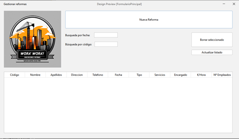
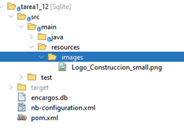
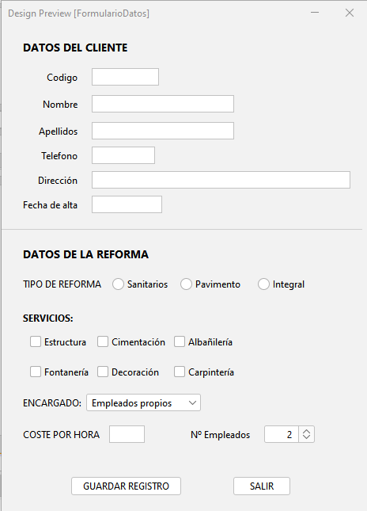
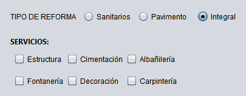
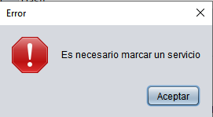
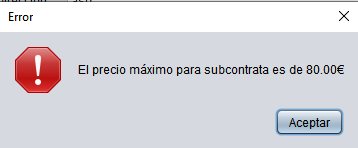
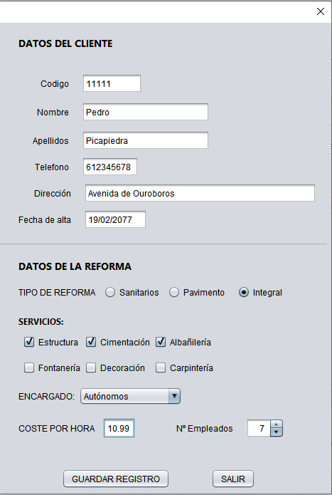
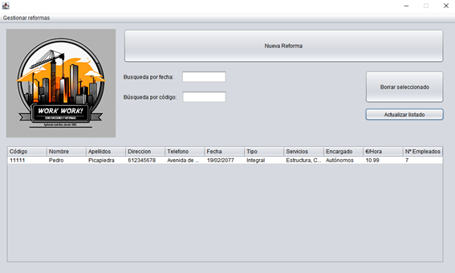

# TAREA 1.12. ELABORACIÓN DE UN PROGRAMA DE GESTIÓN DE SERVICIOS DE OBRA

En primer lugar tuve que escoger un formato que mostrase correctamente los datos de cada reserva. Por comodidad y aprovechar más el espacio elegí un formato de ventana apaisado. Al estar los campos en horizontal, y ser tanto pensé que sería la mejor opción. En caso de introducir muchos elementos en la tabla, considero que sería óptimo implementar un “Scroll bar”, pero no he tenido tiempo.

## La pantalla principal

En esta ventana se muestran la tabla con los registros de reformas. En un principio los datos se cargaban desde la ventana de registro y se almacenaban en memoria, pero al implementar SQLITE introduje el botón de borrar, y he añadido además un botón de actualizar, pues al añadir nuevos desde la ventana de registro en la base de datos, no se mostraban en la lista de la ventana principal automáticamente. La ventana dispone de dos campos con los que filtrar los resultados por fecha y código, usando TableRowSorter.

Tuve un problema con el logo, y es que no había manera de que Netbeans compilase si no se especificaba su ruta completa, con la ruta relativa no funcionaba. Finalmente encontré la solución, hay que crear una carpeta llamada “resources” dentro de la carpeta “main”, y en ese lugar colocar las imágenes que se desean usar. De ese modo, el proyecto ya compila y se puede exportar y usar sin problemas en otros equipos.

Nada más arrancar el programa se hace un chequeo por si el fichero de base de datos no existe, en cuyo caso se crea con los nombres de los campos y su tamaño de campo correcto, para que no podamos introducir en la base de datos cadenas mayores a las permitidas. Para el formulario jDialog que recoge los datos del cliente y la reforma, opté por un diseño que abarcase todos los campos y fuese comedido. He separado las dos secciones para que quedase más clara y diferenciada cada sección de datos.

## La pantalla de recogida de datos

Tuve varios problemas con las validaciones. En primer lugar, no pude usar las validaciones del validationapi por defecto, porque estaban en inglés y no logré que NetBeans usase mi fichero con las traducciones (es_ES). En Ant funciona sin problemas, pero en Maven no he conseguido hacerlo funcionar. Por ello he creado reglas de validación personalizadas para todos los campos de texto. Al principio pensé en usar dos ValidationPanel distintos para la sección de clientes y la sección de datos de reforma, pero por algún motivo a NetBeans, internamente, no le hacía ninguna gracia. Si usaba dos validation panels el comportamiento era errático: a veces me daba por buenos todos los campos y el botón de “GUARDAR REGISTRO” se activaba correctamente, pero en otras ocasiones se mantenía desactivado hasta que actualizaba algún valor de Cliente (por ejemplo al borrar el último dígito del teléfono e introducirlo de nuevo). Al final decidí que era más sencillo dejar un solo validation panel en lugar de pelearme. Para la sección de los datos de reforma establecí que cada vez que se selecciona un tipo de reforma se habilitasen solo los servicios asociados a ese tipo de reforma. Además se desactivan todos los checkbox cada vez que se hace una selección nueva.

Para controlar que se marcase obligatoriamente algún servicio y no quedase vacío he usado un jOptionPane que avise cuando se intenta guardar, de que hay que seleccionar una opción obligatoriamente.

Para delimitar el valor que se introduce en el campo “COSTE POR HORA”, que me parecía el campo más importante del formulario, realizo varias validaciones, primero delimitando el valor que se puede introducir mediante expresiones regulares. Si se introduce un valor negativo se reinicia a 0, si se introduce un valor superior a 80.00 o 99.99 (dependiendo de la selección en el campo “ENCARGADO”) se reinicia a los valores máximos. En caso de que el usuario no pulse intro al introducir los valores (por ejemplo, marcando 99.99 siendo subcontrata, cuyo máximo es 80.00) he incluido un mensaje jOptionPane en la acción de guardado que avisa al usuario que ese importe es incorrecto y evita que se introduzcan los datos erróneos en la base de datos.

Al introducir los datos correctamente, se escriben los datos en la base de datos al pulsar el botón guardar.

Ya al final, cuando todo estaba bastante avanzado me empecé a preguntar como quería que se comportasen las ventanas en cuanto a redimensionarlas. Al final he llegado a la conclusión de que prefiero que sean de tamaño fijo. El programa podría depurarse mucho más y añadir muchas más cosas, como por ejemplo que no se pudiesen introducir entradas con códigos repetidos en la base de datos (que el campo de código fuese AUTO INCREMENT), pero la verdad es que no me quedaba tiempo para implementar muchas cosas que me hubiese gustado dejar a punto.

Creo que en líneas generales he cumplido con lo que se pedía en el ejercicio, sin embargo soy consciente de que podría hacerse mejor.
